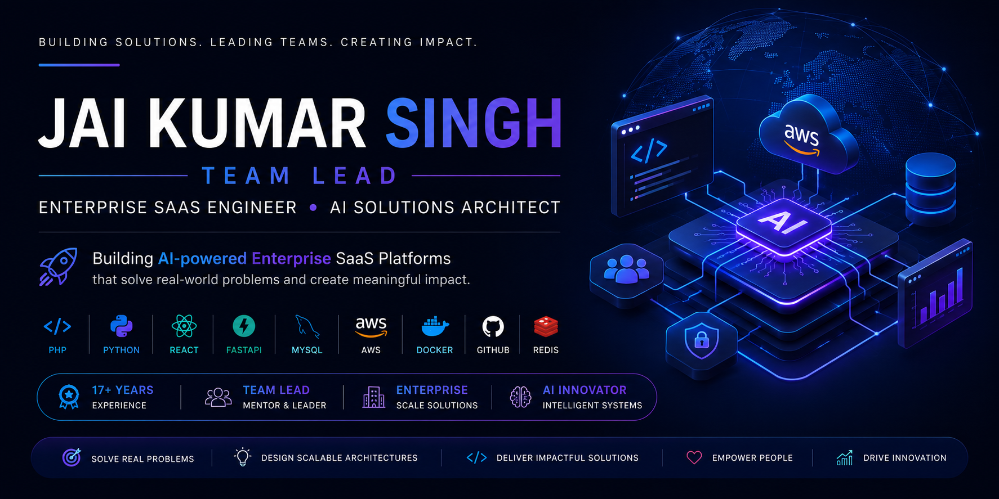

  

<h1 align="center">Hi 👋, I'm Jai Kumar Singh</h1>

<h3 align="center">
Team Lead | AI Solutions Architect | Enterprise SaaS Engineer
</h3>

Building AI-powered Healthcare Platforms • Enterprise SaaS • Real-time Communication Systems

---

# 👨‍💻 About Me

I'm a **Team Lead** with **17+ years of experience** in designing, developing, and delivering enterprise software solutions across Healthcare, Artificial Intelligence, SaaS, and Real-time Communication platforms.

Currently, I lead engineering initiatives for multiple enterprise products, including AI-powered Speech Therapy platforms, healthcare SaaS applications, **VTXLink** (real-time video conferencing), **VTXGames**, and other cloud-native business solutions.

Beyond writing code, I enjoy mentoring developers, designing scalable software architectures, solving complex engineering challenges, and integrating Artificial Intelligence into enterprise applications.

---

# 🚀 What I'm Currently Working On

- 🏥 AI-powered Speech Therapy SaaS Platform
- 🎥 VTXLink – Real-time Video Conferencing
- 🎮 VTXGames
- 🤖 AI-powered Customer Support Solutions
- 📅 Smart Scheduling & Practice Management
- 🧠 Agentic AI & Large Language Models (LLMs)
- ⚡ Model Context Protocol (MCP)
- 📄 AI Research & Technical Writing

---

# 💼 Professional Expertise

- Enterprise SaaS Development
- Healthcare Technology Solutions
- AI Integration & Intelligent Automation
- Software Architecture & System Design
- REST API Development
- Cloud-native Application Development
- Team Leadership & Mentoring
- Performance Optimization
- Secure Application Development
- Agile Software Development

---

# 🛠️ Technology Stack

## Languages

- PHP
- Python
- JavaScript
- TypeScript
- SQL

## Backend

- Yii2
- Laravel
- FastAPI
- Node.js

## Frontend

- React
- Electron
- HTML5
- CSS3
- Bootstrap

## Database

- MySQL
- MariaDB
- Redis

## Cloud & DevOps

- AWS
- Docker
- Linux
- Git
- GitHub

## AI & Automation

- OpenAI
- Google Gemini
- Prompt Engineering
- LLM Integration
- AI Automation
- Model Context Protocol (MCP)

## Testing

- Playwright
- PHPUnit
- API Testing

---

# ⭐ Current Products

- 🏥 AI-powered Speech Therapy Platform
- 🎥 VTXLink – Video Conferencing Platform
- 🎮 VTXGames
- 🤖 AI Customer Support Assistant
- 📅 SaaS Appointment Scheduling Platform
- 📄 AI Proposal Generator

---

# 🌱 Currently Learning

- Agentic AI
- Multi-Agent Systems
- MCP (Model Context Protocol)
- AI Coding Agents
- Advanced Cloud Architecture
- AI-assisted Software Development

---

# 🎯 2026 Goals

- Publish AI Research Papers
- Build Open Source AI Solutions
- Launch AI-powered SaaS Products
- Share Knowledge through Technical Blogs
- Contribute to the AI & Developer Community
- Mentor Engineers and Future Technology Leaders

---

# ✍️ Technical Writing

I regularly share insights on:

- Artificial Intelligence
- SaaS Architecture
- Healthcare Technology
- PHP & Python
- AWS & Cloud
- Software Architecture
- Engineering Leadership

📝 **Hashnode Blog:** Coming Soon

---

# 🤝 Let's Connect

📧 **Email**

jai3738@gmail.com

💼 **LinkedIn**

https://www.linkedin.com/in/jai-k-singh/

🐙 **GitHub**

https://github.com/jais3738

🌐 **Portfolio**

Coming Soon

---

# 💭 Engineering Philosophy

> *"Technology creates real impact when it solves meaningful problems, empowers people, and continuously evolves through learning and innovation."*

---

⭐ Thanks for visiting my profile!

If you find my work useful, feel free to ⭐ the repositories you like.

